<p align="center">
  <a href="https://komarev.com/ghpvc/?username=LokiDevX">
    
  </a>
</p>


## 📌 About Me
- CSE student building practical web applications and improving problem-solving skills  
- Currently focused on full-stack development and DSA (Striver A2Z)  
- Working with React, Node.js, MongoDB, and TypeScript  
- Learning backend fundamentals, clean code, and system design basics  
- Goal: secure internships and grow into a strong full-stack engineer  


## 🧠 My Focus Areas
- Data Structures & Algorithms (Striver A2Z)  
- Backend Development (Node.js, REST APIs, authentication)  
- Frontend Engineering (React, performance, UI/UX)  
- Clean Code & Scalable Design  

[](https://discord.com/users/1005536880659529808)

<!--START_SECTION:waka-->


**I'm an Early 🐤** 

```text
🌞 Morning                6 commits           ⣿⣿⣀⣀⣀⣀⣀⣀⣀⣀⣀⣀⣀⣀⣀⣀⣀⣀⣀⣀⣀⣀⣀⣀⣀   08.82 % 
🌆 Daytime                29 commits          ⣿⣿⣿⣿⣿⣿⣿⣿⣿⣿⣿⣀⣀⣀⣀⣀⣀⣀⣀⣀⣀⣀⣀⣀⣀   42.65 % 
🌃 Evening                16 commits          ⣿⣿⣿⣿⣿⣿⣀⣀⣀⣀⣀⣀⣀⣀⣀⣀⣀⣀⣀⣀⣀⣀⣀⣀⣀   23.53 % 
🌙 Night                  17 commits          ⣿⣿⣿⣿⣿⣿⣀⣀⣀⣀⣀⣀⣀⣀⣀⣀⣀⣀⣀⣀⣀⣀⣀⣀⣀   25.00 % 
```


📊 **This Week I Spent My Time On** 

```text
🕑︎ Time Zone: Asia/Kolkata

💬 Programming Languages: 
Python                   53 mins             ⣿⣿⣿⣿⣿⣿⣿⣿⣿⣿⣿⣀⣀⣀⣀⣀⣀⣀⣀⣀⣀⣀⣀⣀⣀   43.68 % 
Other                    28 mins             ⣿⣿⣿⣿⣿⣿⣀⣀⣀⣀⣀⣀⣀⣀⣀⣀⣀⣀⣀⣀⣀⣀⣀⣀⣀   23.55 % 
CSS                      12 mins             ⣿⣿⣿⣀⣀⣀⣀⣀⣀⣀⣀⣀⣀⣀⣀⣀⣀⣀⣀⣀⣀⣀⣀⣀⣀   10.35 % 
TypeScript               10 mins             ⣿⣿⣀⣀⣀⣀⣀⣀⣀⣀⣀⣀⣀⣀⣀⣀⣀⣀⣀⣀⣀⣀⣀⣀⣀   08.76 % 
Image (jpeg)             9 mins              ⣿⣿⣀⣀⣀⣀⣀⣀⣀⣀⣀⣀⣀⣀⣀⣀⣀⣀⣀⣀⣀⣀⣀⣀⣀   07.92 % 

🔥 Editors: 
VS Code                  2 hrs 1 min         ⣿⣿⣿⣿⣿⣿⣿⣿⣿⣿⣿⣿⣿⣿⣿⣿⣿⣿⣿⣿⣿⣿⣿⣿⣿   100.00 % 

🐱‍💻 Projects: 
Unknown Project          51 mins             ⣿⣿⣿⣿⣿⣿⣿⣿⣿⣿⣿⣀⣀⣀⣀⣀⣀⣀⣀⣀⣀⣀⣀⣀⣀   42.41 % 
lokii                    31 mins             ⣿⣿⣿⣿⣿⣿⣀⣀⣀⣀⣀⣀⣀⣀⣀⣀⣀⣀⣀⣀⣀⣀⣀⣀⣀   25.96 % 
New folder               14 mins             ⣿⣿⣿⣀⣀⣀⣀⣀⣀⣀⣀⣀⣀⣀⣀⣀⣀⣀⣀⣀⣀⣀⣀⣀⣀   12.13 % 
Downloads                9 mins              ⣿⣿⣀⣀⣀⣀⣀⣀⣀⣀⣀⣀⣀⣀⣀⣀⣀⣀⣀⣀⣀⣀⣀⣀⣀   08.12 % 
khub-silk.vercel.app     4 mins              ⣿⣀⣀⣀⣀⣀⣀⣀⣀⣀⣀⣀⣀⣀⣀⣀⣀⣀⣀⣀⣀⣀⣀⣀⣀   03.67 % 

💻 Operating System: 
Windows                  2 hrs 1 min         ⣿⣿⣿⣿⣿⣿⣿⣿⣿⣿⣿⣿⣿⣿⣿⣿⣿⣿⣿⣿⣿⣿⣿⣿⣿   100.00 % 
```

**I Mostly Code in TypeScript** 

```text
TypeScript               8 repos             ⣿⣿⣿⣿⣿⣿⣿⣿⣿⣿⣿⣿⣿⣿⣿⣿⣿⣿⣿⣿⣿⣿⣀⣀⣀   88.89 % 
HTML                     1 repo              ⣿⣿⣿⣀⣀⣀⣀⣀⣀⣀⣀⣀⣀⣀⣀⣀⣀⣀⣀⣀⣀⣀⣀⣀⣀   11.11 % 
```


 Last Updated on 15/05/2026 20:55:30 UTC
<!--END_SECTION:waka-->

## 📊 GitHub Stats & Trophies
<p align="center">
  
</p>
<p align="center">
  
</p>
<div align="center">
  
</div>


## 🛠️ Languages & Tools

<h3 align="center">Programming Languages</h3>
<p align="center">
  &nbsp;&nbsp;
  &nbsp;&nbsp;
  &nbsp;&nbsp;
  

</p>

<h3 align="center">Frontend</h3>
<p align="center">
  &nbsp;&nbsp;
  &nbsp;&nbsp;
  &nbsp;&nbsp;
  &nbsp;&nbsp;
  &nbsp;&nbsp;
  

</p>

<h3 align="center">Backend</h3>
<p align="center">
  &nbsp;&nbsp;
  

</p>

<h3 align="center">Database</h3>
<p align="center">
  &nbsp;&nbsp;
  

</p>

<h3 align="center">Tools</h3>
<p align="center">
  &nbsp;&nbsp;
  &nbsp;&nbsp;
  &nbsp;&nbsp;
  

</p>

<p align="center">
  <a href="https://github.com/lokii-devx">
    
  </a>
</p>

## 🔗 Connect with Me
<p align="center">
  <a href="www.linkedin.com/in/lokesh-navale">
    
  </a>&nbsp;&nbsp;
  <a href="https://wa.me/919281439810">
    
  </a>&nbsp;&nbsp;
  <a href="mailto:lokeshnavale.dev@gmail.com">
    
  </a>&nbsp;&nbsp;
  <a href="https://lokii.dev">
    
  </a>
</p>

<p align="center">
  
</p>

<p align="center"><a href="buymeacoffee.com/navalelokey" target="_blank"></a></p>

<div align="center">
  
</div>

